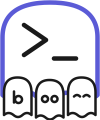
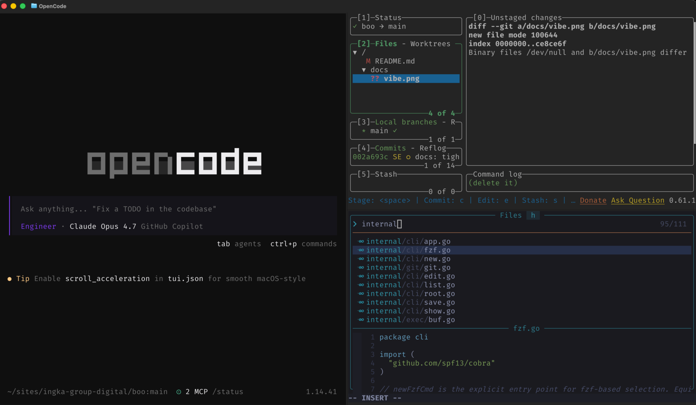
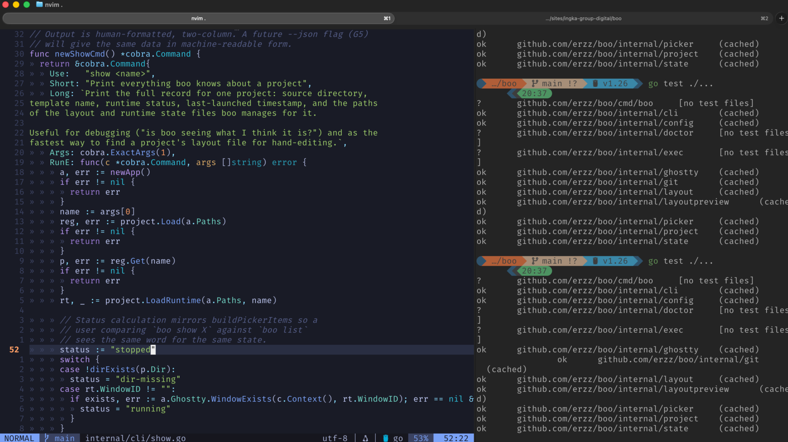
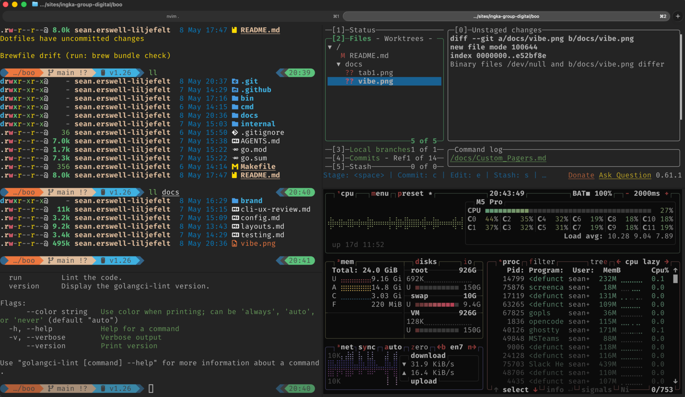
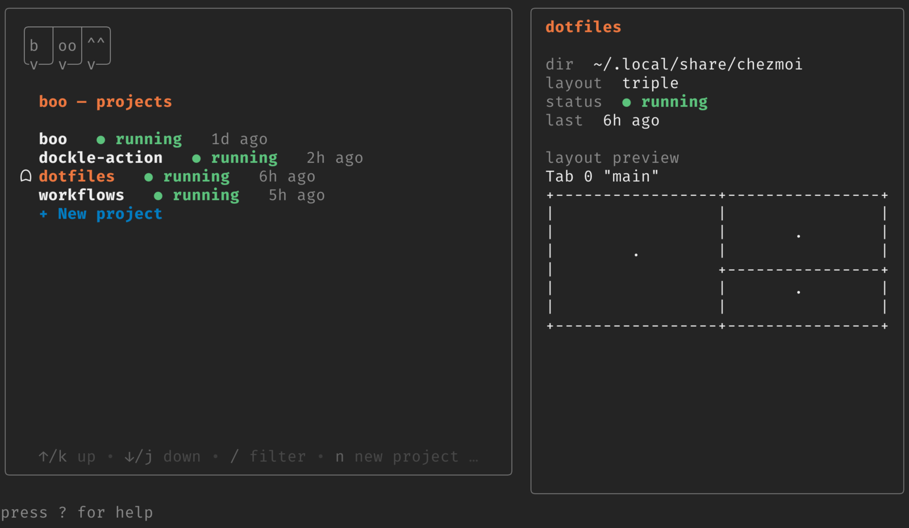
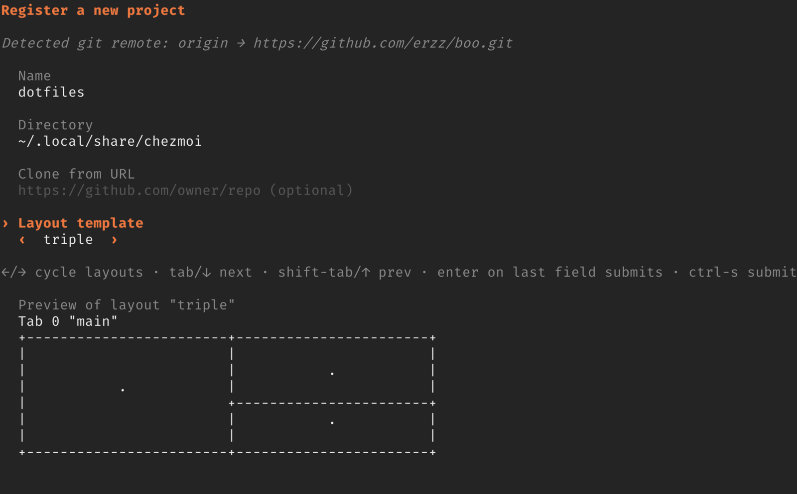

<p align="center">
  
</p>

<p align="center"><i>a haunt for every project</i></p>

# boo

A project launcher for [Ghostty](https://ghostty.org).

**macOS** · Ghostty 1.3.1+

```sh
brew install erzz/tap/boo
```

Switching between projects in a terminal usually means several minutes of yak-shaving: open a new
window, `cd` to the right place, re-open your editor, re-launch the dev server, re-open lazygit in a
split. boo collapses all of that into one command — `boo projA` — and remembers each project's
layout (windows, tabs, splits, working directories, startup commands) so it's identical every time.

## Features

`boo` is both a TUI and a CLI that you can use to register, edit or launch your ghostty sessions
exactly how you like them!

For example, I like to launch my vibe-coding project with a large opencode pane on the left with 2
panes stacked on each other on the right for lazygit and nvim.

`boo myvibeproject` launches a new ghostty window looking like this:

<p align="center">
  
</p>

Meanwhile, in another project for serious work, I like two tabs. Tab 1 has 2 panes (neovim and
tests) and the second tab has four panes for poking around filesystem, btop and some scratch shells.

`boo seriousproject` launches a ghostty window looking like:

<p align="center">
  
</p>

<p align="center">
  
</p>

It has several builtin [layouts](./docs/layouts.md) but you can add your own with a simple yaml. You can switch layouts,
add custom commands for each pane or even create a project from a git repo.

## Why not tmux?

Honestly, I have used tmux for several years and get frustrated occasionally with keybinds, plugins,
poor rendering and losing the native feel and performance of Ghostty for features that I never use.
I hardly ever use persistence or true multiplexing - I just wanna quickly get my terminal
environment launched for any project with right tools, directories, env vars and layout - quickly!

If you are like me and work across dozens and dozens of projects and flip around them all the time,
this is for you! If you need Linux support, persistence or other tmux features, it's not!

## I hope this is temporary!

I can't wait for multiplexing and session management to be built into Ghostty! I will archive this
project one day!

## The Tour

### TUI

`boo` provides a TUI for registering, editing or launching projects. Running `boo` with no arguments
opens the TUI: bordered project list on the left, context preview on the right (when the terminal is
wide enough), status bar & keybindings at the bottom.

<p align="center">
  
</p>

<p align="center">
  
</p>

### CLI

There is also a CLI allowing you to script and manage everything the TUI does with fine-grained
control and extra nerd points!

```
boo                  # interactive picker over all known projects
boo projA            # open or focus the projA window directly
boo new projA        # register a project (existing dir or clone from URL)
boo save             # snapshot the focused window's layout for the current project
boo list             # show all projects (--json to script)
boo show projA       # everything boo knows about a project
boo edit projA       # open a project's layout file in $EDITOR
boo set-layout projA triple   # switch a project to a different layout template
boo layouts          # preview every available layout template
boo themes           # list available visual themes
boo delete projA     # remove a project (--purge to also close its window)
boo config           # inspect / edit global config
boo doctor           # sanity-check your environment
```

## Status

Pre-alpha. Under active development. macOS only.

## How it works

boo drives Ghostty via its native AppleScript / JXA API. There is no tmux, no terminal multiplexer,
no leaky abstraction — splits are Ghostty splits, scrollback is Ghostty scrollback, everything
Ghostty does just works. Windows you opened with boo stay open across switches, so the processes
inside them keep running.

## Interactive picker

| key                  | action                                                                                     |
| -------------------- | ------------------------------------------------------------------------------------------ |
| `↑` / `↓`, `k` / `j` | move selection                                                                             |
| `/`                  | filter by name or path                                                                     |
| `enter`              | switch to the selected project                                                             |
| `n`, `+`             | register a new project                                                                     |
| `e`                  | edit the selected project (rename, change directory, change layout template)               |
| `l`                  | cycle the layout template for the selected project (`←` / `→` to choose, `enter` to apply) |
| `o`                  | open the selected project's layout YAML in `$EDITOR` (TUI suspends, resumes on exit)       |
| `d`                  | delete the selected project (asks to confirm)                                              |
| `D`                  | delete **and** close the project's Ghostty window                                          |
| `T`                  | cycle to the next theme (persisted to `config.yaml` automatically)                        |
| `?`                  | toggle full help                                                                           |
| `q`, `esc`, `ctrl-c` | quit                                                                                       |

The right pane shows the selected project's directory, status (running / stopped / dir-missing),
last-launched time, and an ASCII preview of its current layout.

The status bar reflects the most recent action's outcome: `✓ deleted alpha`, `✖ rename failed: …`,
etc.

## New-project form

`n` (or selecting `+ New project`) opens a form:

- **Name** — display name and the key used by `boo <name>`
- **Directory** — existing path, or a `git@…` / `https://…` URL to clone
- **Layout** — cycler over the available templates (`←` / `→` to choose). Defaults to `triple`.

Submitting the form opens an interactive **layout editor** before the
project is registered, where you can:

- Set a startup `command` for any pane.
- Adjust the proportions of each split (move dividers).

Apply with `ctrl+s` to register the project and open the Ghostty
window. Skip with `esc` to use the template as-is. Cancel the whole
flow from the editor with `esc` (from LAYOUT mode).

### Layout editor

The editor opens in **LAYOUT mode** (move dividers and select panes):

| key | action |
| --- | --- |
| `↑` `↓` `←` `→` (or `h` `j` `k` `l`) | move selection between panes / dividers |
| `+` / `-` (or `>` / `<`) | grow / shrink the selected divider by 5% |
| `0` | reset the selected divider to an even split |
| `c` | edit the selected pane's startup command (enters COMMAND mode) |
| `ctrl+s` | apply: register the project and open the window |
| `esc` | cancel back to the new-project form |

In **COMMAND mode** the textinput owns the keyboard:

| key | action |
| --- | --- |
| any printable | edit the command string |
| `enter` or `esc` | commit and return to LAYOUT mode |

Customised layouts are written to the project's own `layout.yaml`; the
registry remembers the original template key, so `boo set-layout` still
works to swap back later.

## Layouts

Layouts are YAML — one per project, plus shared templates. See
[`docs/layouts.md`](./docs/layouts.md) for the full reference, the bundled built-ins (`triple`,
`1x2x2`, `2x1x1`, …), and copy-paste examples (Node, Go, Rust, Python).

A layout is a tree of windows → tabs → splits. Each leaf can specify:

- `cwd` — initial working directory (defaults to the project's root)
- `command` — long-running command to launch in that pane (e.g. `nvim .`)
- `initial_input` — text to type into the shell after the pane opens (e.g. `lazygit\n`)
- `env` — extra environment variables for that pane

Each interior split can also specify `size` — the first child's
fractional share of the split (e.g. `size: 0.4` gives the left/top pane
40%). Omit for an even split.

`triple` is the default: one large left pane, two stacked panes on the right.

## Configuration

Global config lives at `~/.config/boo/config.yaml`. See [`docs/config.md`](./docs/config.md) for the
schema. `boo config` prints the effective config plus where each value came from; `boo config edit`
opens it in `$EDITOR`.

## Themes

The TUI ships with five built-in themes (`default`, `tokyonight`, `solarized-dark`,
`solarized-light`, `light`) and supports user-authored themes dropped into
`~/.config/boo/themes/`. A theme only colours boo's own UI (borders, accents, status pills) —
your terminal background and ANSI palette stay under Ghostty's control, so pick a boo theme that
coordinates with your Ghostty colour scheme. Activate one with `ui.theme: <name>` in your config.
See [`docs/themes.md`](./docs/themes.md) for the schema, slot reference, and worked examples
(Catppuccin, Gruvbox, monochrome). Run `boo themes init <name>` to scaffold a starter file from
the built-in default.

## Requirements

- macOS
- [Ghostty](https://ghostty.org) 1.3+
- Go 1.25+ (only to build from source)

The first time boo controls Ghostty, macOS will prompt for **Automation** permission. `boo doctor`
detects and surfaces the common setup issues (missing Ghostty, version mismatch, missing automation
permission, missing `$EDITOR`).

## Installation

### Homebrew (recommended)

```sh
brew install erzz/tap/boo
```

After installing, run the setup check:

```sh
boo doctor
```

### Build from source

```
make build
./bin/boo doctor
```

See [`docs/testing.md`](./docs/testing.md) for what CI runs and the manual smoke tests run before a
release.

## License

[MIT](./LICENSE)
